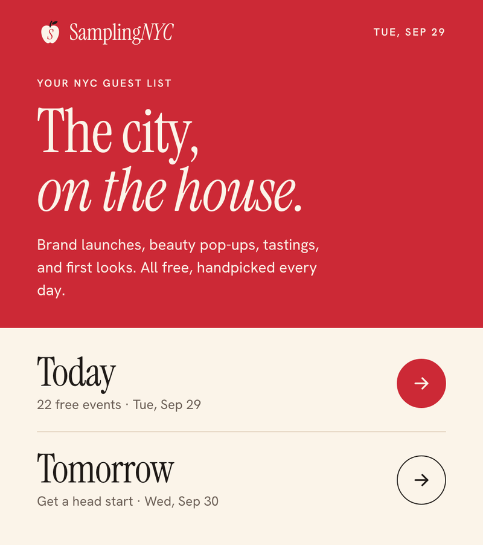

## Hi, I'm Jonathan

I'm a software engineer at Optro (formerly AuditBoard), where I build the Risk Assessments features risk managers use to evaluate and track risk across their organizations. Before that, I worked at Janus Health, automating prior authorization requests for revenue cycle teams at large hospital systems.

Outside of work, I play table tennis, pickleball, and basketball, and I'm the commissioner of the group chat's fantasy NBA league.

[Check out my portfolio](https://jzhou45.github.io/)

## samplingNYC

  

[samplingnyc.com](https://samplingnyc.com) pulls free NYC events from several listing sites into one place. Swipe right to save an event, left to pass, and it maps a route for the day.

- Scheduled scrapers collect each day's events.
- Gemini summarizes and tags them.
- A static React site on GitHub Pages serves the daily list.

## Earlier Projects

Built at App Academy in 2022:

- **[Metabook](https://github.com/jzhou45/Metabook):** a Facebook clone with posts, nested comments, likes, and profiles. Ruby on Rails, React, Redux, PostgreSQL, AWS S3.
- **[.concat](https://github.com/jzhou45/.concat):** collaborative LeetCode practice with a shared live code editor and chat. Built with a team of four. MongoDB, Express, React, Node.js, Socket.io.
- **[Olympus Card-Jitsu](https://github.com/jzhou45/Olympus-Card-Jitsu):** a Greek mythology take on Club Penguin's Card-Jitsu. Vanilla JavaScript. [Play it here](https://jzhou45.github.io/Olympus-Card-Jitsu/).

## Languages and Tools

## Contact Me

